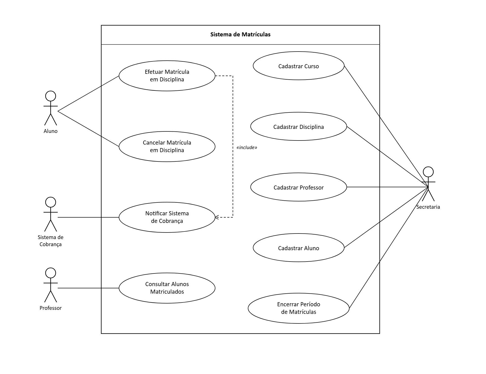

# Sistema de Matrículas

Trabalho da disciplina Laboratório de Desenvolvimento de Software. 
O projeto consiste em modelar e implementar um
sistema de matrículas para uma universidade, dividido em sprints semanais.

## Descrição do sistema

A secretaria da universidade cadastra o currículo de cada semestre e mantém as
informações de disciplinas, professores e alunos. Cada curso tem nome, número
de créditos e é formado por várias disciplinas.

Os alunos se matriculam em 4 disciplinas obrigatórias e mais 2 optativas,
durante o período de matrículas, podendo também cancelar matrículas feitas
antes. Uma disciplina só é confirmada para o semestre seguinte se tiver pelo
menos 3 alunos inscritos ao final do período; caso contrário é cancelada. O
limite máximo é de 60 alunos por disciplina — ao atingir esse número, as
inscrições são encerradas.

Sempre que um aluno se matricula, o sistema de cobranças é notificado para
que o aluno seja cobrado pelas disciplinas do semestre. Professores podem
consultar quais alunos estão matriculados em suas disciplinas. Todo usuário
acessa o sistema com login e senha.

## Diagrama de Caso de Uso

### Atores

- **Aluno** — se matricula e cancela matrícula em disciplinas.
- **Professor** — consulta os alunos matriculados em suas disciplinas.
- **Secretaria** — mantém o cadastro de cursos, disciplinas, professores e
  alunos, e encerra o período de matrículas.
- **Sistema de Cobrança** (sistema externo) — recebe a notificação de novas
  matrículas para gerar a cobrança do aluno.

## Histórias de Usuário

**Efetuar matrícula em disciplina**
Como aluno, quero me matricular em disciplinas durante o período de
matrículas, para garantir minha vaga no semestre.
- O aluno pode se matricular em até 4 disciplinas obrigatórias e 2 optativas.
- Se a disciplina já tiver 60 alunos, a matrícula não é permitida.
- Ao confirmar a matrícula, o sistema de cobrança é notificado.

**Cancelar matrícula em disciplina**
Como aluno, quero cancelar uma matrícula feita anteriormente, para desistir
de uma disciplina ainda dentro do período de matrículas.
- Só é possível cancelar matrículas dentro do período de matrículas aberto.

**Consultar alunos matriculados**
Como professor, quero consultar a lista de alunos matriculados em uma
disciplina que leciono, para saber quem vai cursá-la no semestre.

**Cadastrar curso**
Como secretaria, quero cadastrar os cursos oferecidos pela universidade, para
montar o currículo do semestre.
- Cada curso tem nome e um número de créditos.

**Cadastrar disciplina**
Como secretaria, quero cadastrar as disciplinas de cada curso, para compor o
currículo do semestre.
- Cada disciplina pertence a um curso, e um curso pode ter várias disciplinas.

**Cadastrar professor**
Como secretaria, quero cadastrar os professores disponíveis para lecionar,
para associá-los às disciplinas do semestre.

**Cadastrar aluno**
Como secretaria, quero cadastrar os alunos da universidade, para que eles
possam se matricular nas disciplinas.

**Encerrar período de matrículas**
Como secretaria, quero encerrar o período de matrículas, para que o sistema
confirme ou cancele as disciplinas do semestre.
- Disciplinas com menos de 3 alunos inscritos são canceladas automaticamente.
- Disciplinas com 3 ou mais alunos ficam confirmadas para o semestre.

**Notificar sistema de cobrança**
Como sistema de cobrança, quero ser notificado sempre que um aluno se
matricula em uma disciplina, para gerar a cobrança correspondente.

## Entregas por sprint

- **Sprint 1** — diagrama de caso de uso e histórias de usuário. 
- **Sprint 2** — diagrama de classes e projeto Java com stub dos métodos.
- **Sprint 3** — protótipo funcional, com interface e persistência em arquivo.
