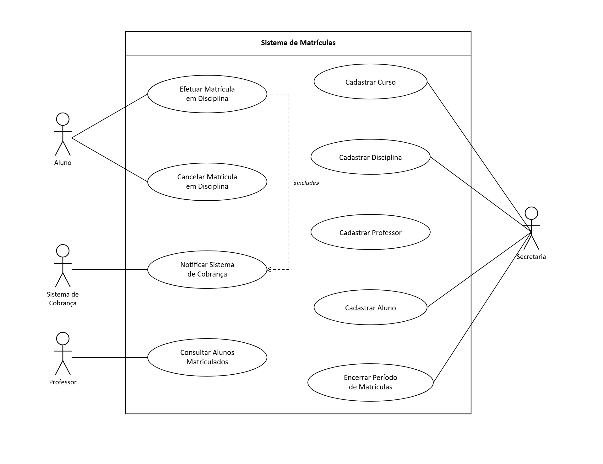
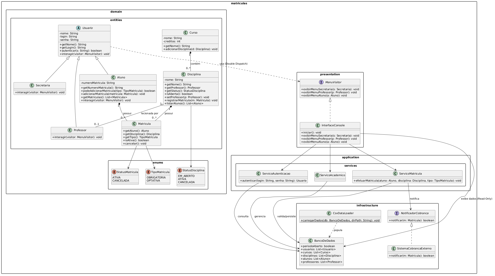

<div align="center">

# Sistema de Matrículas Universitário


</div>

**Instituição:** Pontifícia Universidade Católica de Minas Gerais (PUC Minas)  
**Curso:** Engenharia de Software · **Disciplina:** Projeto de Software  
**Professora:** Milena Menezes Adão · **Atividade:** Laboratório 1 — 2º Semestre/2026  
**Integrantes:** Lucas Lima Magalhães Lafetá Chaves e Sérgio Izaías Parreiras Junior  

---

## 📖 Sobre o projeto

O projeto consiste na modelagem e implementação de um **Sistema de Matrículas** interativo para uma universidade, desenvolvido de forma iterativa ao longo de três *sprints* semanais. 

O sistema foi desenhado utilizando **Clean Architecture** e princípios **SOLID** (com destaque para o uso do Padrão Comportamental *Visitor* e o Princípio de Inversão de Dependência), garantindo um código altamente modular, encapsulado e fácil de manter. Todo o protótipo funciona via interface de linha de comando (CLI) com persistência em arquivos CSV, rodando de forma isolada através do Docker.

### ⚙️ Regras de Negócio Implementadas

- **Secretaria:** Cadastra o currículo (cursos, disciplinas, professores e alunos) e controla a abertura/fechamento do semestre.
- **Aluno:** Realiza e cancela matrículas limitadas a **4 obrigatórias** e **2 optativas**.
- **Quórum Mínimo:** Ao encerrar o período de matrículas, disciplinas com **menos de 3 alunos** são automaticamente canceladas pelo sistema.
- **Vagas:** Limite estrito de **60 alunos** por disciplina.
- **Integração Financeira:** Notificação automática e assíncrona ao sistema de cobranças externo sempre que uma nova matrícula é efetivada.

---

## 🛠️ Tecnologias

| Tecnologia | Uso neste projeto |
|---|---|
| **Java 21 (LTS)** | Linguagem base do sistema, utilizando *Streams* e recursos modernos. |
| **Arquitetura Limpa** | Divisão estrita em camadas: `domain`, `application`, `infrastructure`, `presentation`. |
| **Design Patterns** | Uso do padrão **Visitor** (Double Dispatch) para roteamento de menus sem uso de `if/else` excessivo. |
| **Arquivos CSV** | Persistência e carga inicial de dados simulando um banco de dados relacional em memória. |
| **Docker & Compose** | Empacotamento *Multi-stage build* garantindo que a aplicação rode em qualquer ambiente sem necessidade de configuração prévia do Java. |

---

## 👤 Atores e Casos de Uso



- 🎓 **Aluno** — Se matricula e cancela matrícula em disciplinas.
- 👨‍🏫 **Professor** — Consulta os alunos matriculados em suas disciplinas vinculadas.
- 🏢 **Secretaria** — Mantém o cadastro de cursos, disciplinas, professores e alunos, e encerra o período de matrículas (gerando o currículo).
- 💰 **Sistema de Cobrança** *(sistema externo)* — Recebe a notificação de novas matrículas para gerar a cobrança do faturamento.

---

## 📝 Histórias de Usuário

*   **Efetuar matrícula em disciplina:** Como aluno, quero me matricular em disciplinas durante o período de matrículas, para garantir minha vaga no semestre. O aluno pode se matricular em até 4 disciplinas obrigatórias e 2 optativas. Se a disciplina já tiver 60 alunos, a matrícula não é permitida. Ao confirmar a matrícula, o sistema de cobrança é notificado.
*   **Cancelar matrícula em disciplina:** Como aluno, quero cancelar uma matrícula feita anteriormente, para desistir de uma disciplina ainda dentro do período de matrículas. Só é possível cancelar matrículas dentro do período de matrículas aberto.
*   **Consultar alunos matriculados:** Como professor, quero consultar a lista de alunos matriculados em uma disciplina que leciono, para saber quem vai cursá-la no semestre.
*   **Cadastrar curso:** Como secretaria, quero cadastrar os cursos oferecidos pela universidade, para montar o currículo do semestre. Cada curso tem nome e um número de créditos.
*   **Cadastrar disciplina:** Como secretaria, quero cadastrar as disciplinas de cada curso, para compor o currículo do semestre. Cada disciplina pertence a um curso, e um curso pode ter várias disciplinas.
*   **Cadastrar professor:** Como secretaria, quero cadastrar os professores disponíveis para lecionar, para associá-los às disciplinas do semestre.
*   **Cadastrar aluno:** Como secretaria, quero cadastrar os alunos da universidade, para que eles possam se matricular nas disciplinas.
*   **Encerrar período de matrículas:** Como secretaria, quero encerrar o período de matrículas, para que o sistema confirme ou cancele as disciplinas do semestre. Disciplinas com menos de 3 alunos inscritos são canceladas automaticamente. Disciplinas com 3 ou mais alunos ficam confirmadas para o semestre.
*   **Notificar sistema de cobrança:** Como sistema de cobrança, quero ser notificado sempre que um aluno se matricula em uma disciplina, para gerar a cobrança correspondente.

---

## 🏛️ Diagrama de Classes (Arquitetura)



---

## 📂 Arquitetura do Código

O projeto separa as responsabilidades seguindo o isolamento de domínio:

```text
SISTEMA-MATRICULAS/
├── dados/                   # Carga inicial do banco (alunos.csv, disciplinas.csv, etc.)
├── docs/                    # Diagramas e documentações das sprints
├── docker-compose.yml       # Orquestração do container interativo
├── Dockerfile               # Multi-stage build (Temurin JDK 21 -> JRE)
└── src/matriculas/
    ├── domain/              # Núcleo duro: Entidades (Aluno, Disciplina) e Enums
    ├── application/         # Casos de Uso: ServicoMatricula, ServicoAcademico
    ├── infrastructure/      # Repositórios (BancoDeDados, CsvLoader) e Mock Cobrança
    ├── presentation/        # Interface CLI: Visitor, Cores ANSI, Menus Interativos
    └── Main.java            # Bootstrapper (Inicializador e Injeção de Dependências)