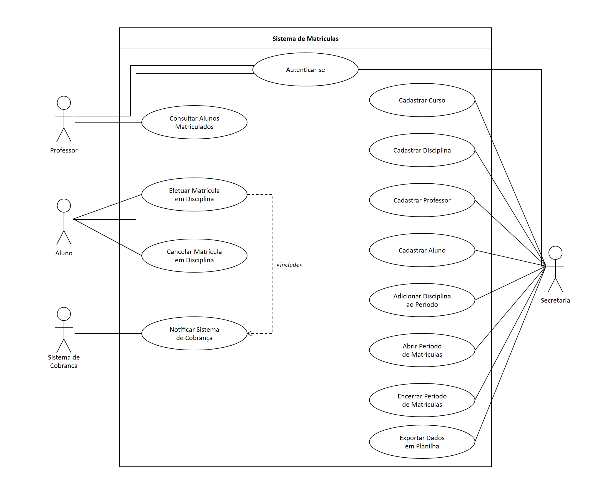
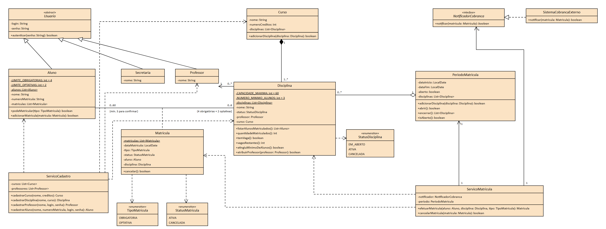

# Sistema de Matrículas

Trabalho da disciplina Laboratório de Desenvolvimento de Software. 
O projeto consiste em modelar e implementar um
sistema de matrículas para uma universidade, dividido em sprints semanais.

## Integrantes

- Lucas Lima Magalhães Lafetá Chaves
- Sérgio Izaías Parreiras Junior

## Descrição do sistema

A secretaria da universidade cadastra o currículo de cada semestre e mantém as
informações de disciplinas, professores e alunos. Cada curso tem nome, número
de créditos e é formado por várias disciplinas.

Os alunos se matriculam em 4 disciplinas obrigatórias e mais 2 optativas,
durante o período de matrículas, podendo também cancelar matrículas feitas
antes. Uma disciplina só é confirmada para o semestre seguinte se tiver pelo
menos 3 alunos inscritos ao final do período; caso contrário é cancelada. O
limite máximo é de 60 alunos por disciplina — ao atingir esse número, as
inscrições são encerradas.

Sempre que um aluno se matricula, o sistema de cobranças é notificado para
que o aluno seja cobrado pelas disciplinas do semestre. Professores podem
consultar quais alunos estão matriculados em suas disciplinas. Todo usuário
acessa o sistema com login e senha.

## Diagrama de Caso de Uso



### Atores

- **Aluno** — se matricula e cancela matrícula em disciplinas.
- **Professor** — consulta os alunos matriculados em suas disciplinas.
- **Secretaria** — mantém o cadastro de cursos, disciplinas, professores e
  alunos, e encerra o período de matrículas.
- **Sistema de Cobrança** (sistema externo) — recebe a notificação de novas
  matrículas para gerar a cobrança do aluno.

## Histórias de Usuário

### Aluno

#### Efetuar matrícula em disciplina

> **Como** aluno, **quero** me matricular em disciplinas durante o período de matrículas, **para** garantir minha vaga no semestre.

- O aluno pode se matricular em até 4 disciplinas obrigatórias e 2 optativas.
- Se a disciplina já tiver 60 alunos, a matrícula não é permitida.
- Ao confirmar a matrícula, o sistema de cobrança é notificado.

#### Cancelar matrícula em disciplina

> **Como** aluno, **quero** cancelar uma matrícula feita anteriormente, **para** desistir de uma disciplina ainda dentro do período de matrículas.

- Só é possível cancelar matrículas com o período de matrículas aberto.

### Professor

#### Consultar alunos matriculados

> **Como** professor, **quero** consultar a lista de alunos matriculados em uma disciplina que leciono, **para** saber quem vai cursá-la no semestre.

### Secretaria

#### Cadastrar curso

> **Como** secretaria, **quero** cadastrar os cursos oferecidos pela universidade, **para** montar o currículo do semestre.

- Cada curso tem nome e um número de créditos.

#### Cadastrar disciplina

> **Como** secretaria, **quero** cadastrar as disciplinas de cada curso, **para** compor o currículo do semestre.

- Cada disciplina pertence a um curso, e um curso pode ter várias disciplinas.

#### Cadastrar professor

> **Como** secretaria, **quero** cadastrar os professores disponíveis para lecionar, **para** associá-los às disciplinas do semestre.

#### Cadastrar aluno

> **Como** secretaria, **quero** cadastrar os alunos da universidade, **para** que eles possam se matricular nas disciplinas.

#### Encerrar período de matrículas

> **Como** secretaria, **quero** encerrar o período de matrículas, **para** que o sistema confirme ou cancele as disciplinas do semestre.

- Disciplinas com menos de 3 alunos inscritos são canceladas automaticamente.
- Disciplinas com 3 ou mais alunos ficam confirmadas para o semestre.

### Sistema externo

#### Notificar sistema de cobrança

> **Como** sistema de cobrança, **quero** ser notificado sempre que um aluno se matricula em uma disciplina, **para** gerar a cobrança correspondente.

## Diagrama de Classes



## Entregas por sprint

- **Sprint 1** — diagrama de caso de uso e histórias de usuário. 
- **Sprint 2** — diagrama de classes e projeto Java com stub dos métodos.
- **Sprint 3** — protótipo funcional, com interface e persistência em arquivo.

## Estrutura do projeto

```
docker-compose.yml        sobe a API e a tela com um comando
docs/diagramas/           diagramas UML
src/
  back/                   API em Java
    matriculas/           código (models, services, enums, interfaces,
                          persistencia, cli, web)
    tests/                testes em Java puro
    Dockerfile
  front/                  tela em Python (Streamlit)
    app.py, telas/        código da interface
    assets/               símbolo da PUC Minas
    Dockerfile
```

## Como executar

### Com Docker

Precisa do Docker Desktop aberto. Na primeira vez o build baixa as imagens, então
é preciso internet; depois disso roda offline.

```bash
docker compose up --build
```

- Tela: http://localhost:18501
- API: http://localhost:18080/api/saude

Se alguma dessas portas já estiver em uso, dá para trocar sem editar arquivos. Por
exemplo, no PowerShell: `$env:PORTA_TELA=19000; $env:PORTA_API=19001; docker compose up --build`
(e no Linux/macOS: `PORTA_TELA=19000 PORTA_API=19001 docker compose up --build`).

O login da secretaria é `secretaria` / `admin123`. Na aba **Dados** do painel dela
dá para popular o sistema e testar as regras:

- **Carregar dados de exemplo** (só com o sistema vazio), em dois tamanhos. O básico
  cria 1 curso, 2 professores (`ana` e `carlos`), 5 alunos (`aluno1` a `aluno5`) e 4
  disciplinas; o completo, 2 cursos, 4 professores (mais `beatriz` e `diego`), 20
  alunos e 8 disciplinas. As disciplinas já entram no período, que continua fechado,
  e todos os usuários têm senha `1234`.
- **Gerar matrículas de exemplo** (com o período aberto): matricula os alunos em
  quantidades diferentes por disciplina, respeitando o limite de 4 obrigatórias e 2
  optativas. Ao encerrar o período, umas disciplinas são confirmadas e outras
  canceladas.
- **Lotar disciplina**: cria alunos (`lotacao1`, `lotacao2`...) até a disciplina
  chegar a 60, para testar o bloqueio de novas matrículas.

Na mesma aba há o botão **Baixar planilha (.xlsx)**, que baixa pelo navegador (pasta
Downloads) uma planilha formatada, com uma aba para cada tabela e sem as senhas. Os dados ficam
num volume do Docker e continuam depois de parar os containers.

```bash
docker compose down
```

Para apagar também os dados: `docker compose down -v`.

### Sem Docker (terminal)

Precisa de um JDK (testado com o 25). Compilando tudo (código e testes) para a pasta `out`:

```powershell
$arquivos = Get-ChildItem -Recurse -Filter *.java src\back | ForEach-Object FullName
javac -encoding UTF-8 -d out $arquivos
```

ou, em Linux/macOS/Git Bash:

```bash
javac -encoding UTF-8 -d out $(find src/back -name "*.java")
```

Depois:

```bash
java -cp out matriculas.Main           # interface de linha de comando
java -cp out matriculas.MainWeb        # só a API, na porta 8080
java -cp out matriculas.ExecutarTestes # testes
```

Fora do Docker os dados são gravados na pasta `dados/`, dentro do diretório onde o
comando foi executado.
